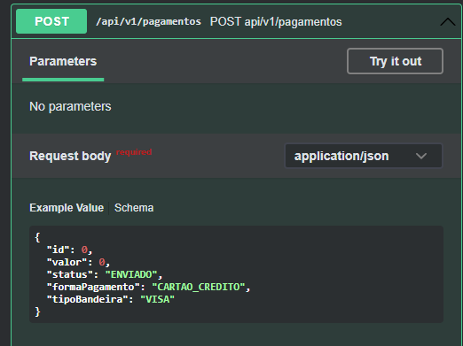
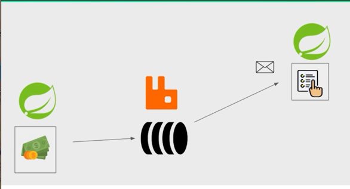
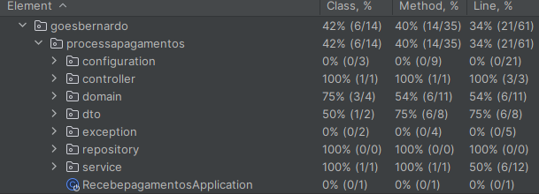

# recebePagamentos
Serviço responsável por receber a requisição de pagamentos utilizando as seguintes tecnologias : 

	* Docker
	* Docker-Compose
	* RabbitMQ
	* Jaeger
	* PostgreSQL
	* Swagger
	* Mockito
	* JUnit
	* Spring Boot
	* Spring Data
	
Descrição da funcionalidade da aplicação :

	O Serviço consiste em receber requisições de pagamentos na modalidade CRÉDITO , onde são efetuadas validações de algumas regras e caso esteja tudo OK a requisição é enviada para o serviço responsável por processar a informação de compra , as informações de requisição são salvas em
	um banco de dados . 
	
	
Instruções básicas para subir o contexto da aplicação :

	* para que o contexto do spring boot possa ir ao ar é necessário subir as imagens através do arquivo ''docker-compose.yml'' , para que o docker-compose faça a tratativa de subir as imagens é necessário um script : "docker-compose up --build" , para parar de utlizar as imagens
	basta incluir o script "docker-compose down"  OBS: sem as aspas.
	

Segue abaixo body de requisição ao serviço : 

Segue abaixo desenho técnico da solução proposta : 

Demonstrativo de cobertura de testes : 

	

	
